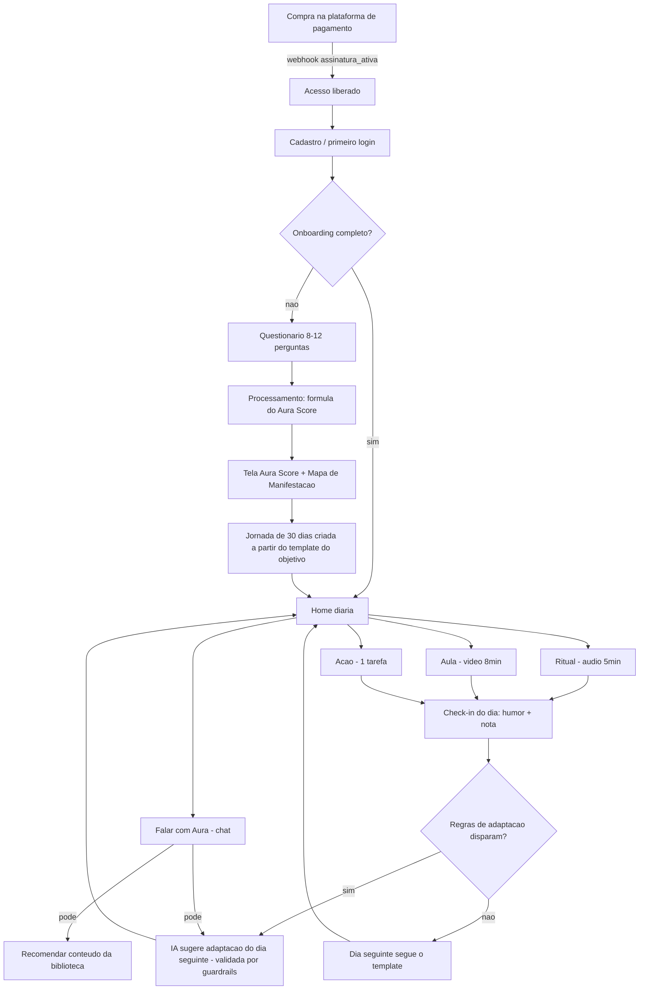

# Círculo Aura — PRD V1 (documento para o DEV)

> **Status:** aprovado em desenho (2026-08-25), aguardando revisão final do documento.
> **Produto:** Círculo Aura (evolução do repo `comunidade-ia`).
> **Autoria:** Diamond Global / Pedro Castilho, com briefing do Francisco.
> **Objetivo deste documento:** o dev termina de ler sabendo exatamente o produto que precisa construir.

---

## 1. Visão do produto

### O que é o Círculo Aura
Plataforma web de **manifestação e desenvolvimento pessoal** por assinatura recorrente. O membro entra, responde um questionário curto, recebe seu **Aura Score** (retrato 0–100 da vida dele em 5 dimensões), e a plataforma monta uma **jornada diária de 30 dias** com ritual (áudio), aula (vídeo) e ação (tarefa) — acompanhado pela **Aura**, uma agente de IA com memória que conversa, orienta e adapta o plano.

### Problema que resolve
Pessoas que querem transformar a vida (dinheiro, relacionamentos, saúde, propósito) consomem conteúdo solto e desistem por falta de direção e constância. O Círculo Aura entrega **um plano diário claro + acompanhamento personalizado**, no lugar de uma biblioteca genérica de cursos.

### Proposta central
> "Você não precisa descobrir sozinho o que fazer. A Aura conhece você, mede onde você está e te entrega o próximo passo — todos os dias."

### Identidade visual
- **Nome:** Círculo Aura.
- **Paleta:** preto e dourado — tom misterioso/premium, referência **Dunity**.
  - Base: preto profundo (`#0A0A0A` / `#111111`), superfícies grafite (`#1A1A1A`).
  - Destaque: dourado (`#C9A24B` primário, `#E5C878` hover/brilho).
  - Texto: off-white (`#F5F0E8`) e cinza quente (`#9C948A`).
- **Tipografia:** display serifada elegante para títulos (ex.: Cormorant Garamond ou Playfair Display) + sans limpa para corpo (ex.: Inter).
- **Importante:** isso **substitui** a paleta esmeralda atual da web. Rebrand completo de layout, logo e telas.

### Jornada macro do usuário
```
Compra (checkout externo) → Cadastro/Login → Questionário (8–12 perguntas)
→ Processamento → Aura Score + Mapa de Manifestação → Jornada criada
→ Home diária (Ritual + Aula + Ação) → Check-in → IA adapta o amanhã
→ (a qualquer momento) Biblioteca e chat com a Aura
```

### O que ENTRA no MVP (V1)
- Cadastro, login e liberação de acesso por webhook de assinatura recorrente.
- Questionário de onboarding (8–12 perguntas) no primeiro login.
- Aura Score calculado por **fórmula determinística** (sem LLM) + Mapa de Manifestação.
- Motor de jornadas: templates de 30 dias por objetivo, home diária, check-in, adaptação da IA **dentro de guardrails**.
- Biblioteca: cursos/módulos/aulas em vídeo + **áudios de frequência** (novo tipo de conteúdo), com progresso e busca.
- Aura (agente de IA): chat com memória por usuário, personalidade própria, recomendação de conteúdo real.
- Admin (Filament): conteúdo, templates de jornada, usuários, prompts da IA, métricas.
- Analytics: eventos desde o dia 1.
- Segurança: protocolo de crise, disclaimers, LGPD.

### O que NÃO entra no V1 (roadmap V2+)
- Comunidade (posts, comentários entre membros, canais, moderação, denúncias).
- Cursos premium avulsos com checkout próprio (lock/unlock). O campo `premium` já existe no modelo, mas todo conteúdo do V1 é liberado pela assinatura.
- Gamificação completa (XP, badges, desafios). O "Dia N 🔥" da home é o **dia da jornada**, não um sistema de streak.
- App nativo (o app Flutter existente fica **congelado** até a web validar).
- Questionário completo de 25 perguntas (a Aura coleta o restante naturalmente nas conversas e salva na memória).

### Regra de escopo combinada
Tentamos entregar **tudo acima na V1**. Se algum item travar ou não funcionar bem, ele sai para a V2 conforme o **plano de corte da §15** — nunca atrasa o lançamento.

---

## 2. Fluxo completo



Fluxos paralelos permanentes: **Biblioteca** (navegar/assistir/ouvir qualquer conteúdo) e **Chat com a Aura** — ambos acessíveis pelo menu a qualquer momento após o onboarding.

Webhook de cancelamento/atraso → `assinatura_status` muda → middleware bloqueia conteúdo (usuário vê tela "reative sua assinatura").

---

## 3. Onboarding (questionário do primeiro login)

Obrigatório no primeiro acesso (não dá para pular; barra de progresso; uma pergunta por tela). Perguntas ficam em tabela editável no admin, mas o V1 lança com estas 12:

| # | Pergunta | Tipo | Obrig. | Alimenta |
|---|----------|------|--------|----------|
| 1 | Como você quer ser chamado(a)? | texto curto | sim | memória IA (`apelido`) |
| 2 | O que você mais quer transformar agora? (Prosperidade / Relacionamentos / Saúde e Energia / Propósito e Carreira / Mentalidade e Paz interior) | escolha única | sim | objetivo principal → template da jornada |
| 3 | E em segundo lugar? (mesmas opções, menos a escolhida) | escolha única | não | objetivo secundário → peso do score |
| 4 | De 0 a 10, como está sua vida financeira hoje? | escala 0–10 | sim | score Prosperidade |
| 5 | De 0 a 10, como estão seus relacionamentos (amor, família, amizades)? | escala 0–10 | sim | score Relacionamentos |
| 6 | De 0 a 10, como estão sua saúde e sua energia no dia a dia? | escala 0–10 | sim | score Saúde/Energia |
| 7 | De 0 a 10, o quanto você sente que sua vida tem direção e propósito? | escala 0–10 | sim | score Propósito |
| 8 | De 0 a 10, como está sua mente (paz, foco, ansiedade)? | escala 0–10 | sim | score Mentalidade |
| 9 | De 0 a 10, o quanto você acredita que sua realidade pode mudar nos próximos 90 dias? | escala 0–10 | sim | fator crença (compõe Mentalidade + padrões) |
| 10 | O que mais te trava hoje? (Falta de tempo / Falta de disciplina / Não sei por onde começar / Medo e insegurança / Pessoas e ambiente ao redor) | escolha única | sim | padrões + memória IA |
| 11 | Quanto tempo por dia você tem para sua transformação? (5–10 min / 15–20 min / 30+ min) | escolha única | sim | calibragem da jornada |
| 12 | Descreva em poucas frases a vida que você quer manifestar. | texto livre | não | memória IA (semente do contexto) |

Regras:
- Respostas gravadas em `questionario_respostas` (uma linha por pergunta).
- P1, P2, P10 e P12 geram entradas em `aura_memorias` com `origem = questionario`.
- Ao concluir: calcula score (§4), cria jornada (§6), marca `users.onboarding_completo_em`, dispara `onboarding_completed`.

---

## 4. Aura Score

**Regra de ouro: o LLM não participa do cálculo.** Tudo é fórmula fixa em PHP, testável por unit test. A IA apenas *comenta* o resultado.

### Dimensões (seed fixa, tabela `dimensoes`)
1. Prosperidade (`prosperidade`)
2. Relacionamentos (`relacionamentos`)
3. Saúde e Energia (`saude-energia`)
4. Propósito e Carreira (`proposito`)
5. Mentalidade e Paz interior (`mentalidade`)

### Cálculo (0–100)
```
score_dimensao      = resposta_escala × 10            // P4–P8, cada uma → 0–100
score_mentalidade   = round((P8×10 + P9×10) / 2)      // média entre estado da mente e crença

peso_dimensao:
  objetivo principal (P2)   → 2.0
  objetivo secundário (P3)  → 1.5   // se respondido
  demais                    → 1.0

aura_score_global = round( Σ(score_dimensao × peso) / Σ(pesos) )
```

### Prioridades
- **Prioridade da jornada** = objetivo principal (P2). É ela que escolhe o template.
- **Ponto de atenção do Mapa** = dimensão de **menor score**. Se empatar, vence a que estiver entre objetivo principal/secundário; persistindo empate, ordem da tabela `dimensoes`.

### Padrões (regras determinísticas, avaliadas em ordem; pode acumular até 2)
| Padrão | Condição | Texto exibido (base) |
|--------|----------|----------------------|
| `reconstrucao` | score global < 40 | "Você está em fase de reconstrução — pequenos passos diários valem mais que saltos." |
| `desequilibrio` | (maior − menor score de dimensão) > 30 | "Sua energia está concentrada em uma área e outra ficou para trás." |
| `bloqueio_crenca` | P9 ≤ 4 | "Seu maior trabalho agora é a crença — antes da estratégia." |
| `pronto_para_acelerar` | score global ≥ 70 e P9 ≥ 7 | "Você está em um bom momento para acelerar." |
| `base_solida` | nenhum dos anteriores | "Você tem uma base estável para construir." |

### Resultado apresentado (tela pós-questionário)
1. Número grande: **Aura Score global** (0–100) com animação de revelação.
2. **Mapa de Manifestação**: gráfico radar (ou 5 barras, ver plano de corte) com o score de cada dimensão, destacando em dourado o objetivo principal e marcando o ponto de atenção.
3. Padrões identificados (1–2 cards com os textos acima).
4. CTA único: **"Começar minha jornada"** → cria a jornada e leva à home.

Persistência em `aura_scores` (histórico — recálculo só quando refizer o questionário, fora do V1, ou por decisão futura; **nunca** pela IA).

---

## 5. Aura — o agente de IA

### Identidade e personalidade
- Nome: **Aura**. Voz feminina, PT-BR.
- Tom: acolhedora, elegante e levemente misteriosa (coerente com preto/dourado); direta com carinho; fala simples, sem jargão de coach; usa o apelido do usuário; mensagens curtas (2–4 parágrafos no máximo).
- Nunca: prometer resultado garantido, humilhar, diagnosticar, fingir ser humana (se perguntada, confirma que é IA).

### Modelo e infraestrutura
- Modelo V1: **`claude-haiku-4-5-20251001`** (mesma infra de chaves já operada na plataformaIA; chave via variável de ambiente, nunca hardcoded).
- Modelo, temperatura, máx. tokens e system prompt ficam em `ia_configuracoes` — **editáveis no admin sem deploy**.
- Streaming de resposta na interface de chat.

### Contexto injetado por mensagem (o que a Aura "sabe")
1. System prompt base (admin) + regras de segurança fixas (código, não editáveis).
2. Perfil: apelido, objetivo principal/secundário, tempo disponível.
3. Aura Score atual (global + dimensões + padrões).
4. Jornada: dia atual, atividades do dia e status de conclusão.
5. Últimos 5 check-ins (humor + notas).
6. Memórias ativas de `aura_memorias` (mais recentes primeiro, com teto de tokens).
7. Últimas ~20 mensagens da conversa atual.

**Contexto proibido:** dados de outros usuários, dados de pagamento, e-mail/telefone, prompts internos do sistema (se pedirem, recusa com leveza).

### Memória
- Tabela `aura_memorias`: fatos, preferências, objetivos e contextos por usuário.
- Origem: questionário (onboarding) + extração pós-conversa (job assíncrono que pede ao modelo "liste fatos novos e duráveis sobre o usuário nesta conversa" em saída estruturada; grava com `origem = conversa`).
- Memórias são desativáveis pelo admin e apagáveis a pedido do usuário (LGPD, §14).

### Ferramentas (function calling) — únicas ações que a Aura pode executar
| Ferramenta | O que faz | Guardrail |
|-----------|-----------|-----------|
| `buscar_conteudo(termo, tipo?)` | Busca cursos/aulas/áudios **reais** no catálogo | Só recomenda IDs retornados pela busca — nunca inventa conteúdo |
| `sugerir_adaptacao(dia, atividade, substituto_id, motivo)` | Propõe trocar uma atividade de dia futuro | Passa pelo validador de regras da §6 antes de aplicar; rejeição é silenciosa para o usuário ("vou manter seu plano") |
| `registrar_checkin(humor, nota)` | Registra check-in quando o usuário desabafa o dia no chat | Só se o check-in do dia ainda não existe |

### Classificação de conversas
Job pós-conversa classifica o tema (`prosperidade`, `relacionamentos`, `saude`, `proposito`, `mentalidade`, `duvida-plataforma`, `crise`) e grava em `aura_conversas.classificacao` — alimenta métricas do admin e recomendações futuras.

### Objetivos do agente (nesta ordem)
1. Manter o usuário fazendo o plano diário (constância).
2. Ajudar com dúvidas e emoções relacionadas à jornada.
3. Recomendar conteúdo certo na hora certa.
4. Coletar (com naturalidade, sem interrogatório) o contexto que o questionário curto não pegou.

### Limites e segurança do agente
Detalhados na §14. Resumo: não é terapeuta, médica nem consultora financeira; em sinais de crise, protocolo de crise **sobrepõe qualquer outra instrução**.

---

## 6. Motor de jornadas

### Estrutura conceitual
```
Objetivo (P2) → Template de jornada (30 dias) → Etapas/Pilares (semanas temáticas)
→ Dia: Ritual (áudio) + Aula (vídeo) + Ação (tarefa) → Check-in → Adaptação
```

### Templates (conteúdo editorial, cadastrado no admin)
- 5 templates no lançamento — um por objetivo/dimensão — com 30 dias cada.
- Cada template é dividido em **4 etapas (pilares)** de ~1 semana (ex. Prosperidade: 1. Consciência, 2. Crença, 3. Ação, 4. Expansão).
- Cada dia do template define: ritual (referência a um áudio), aula (referência a uma aula da biblioteca), ação (texto da tarefa) e, opcionalmente, **equivalentes** (pool de substitutos aceitáveis para a adaptação).
- Calibragem por tempo (P11): o template marca dias com variante `curta` (5–10 min) e `completa`; usuário de 5–10 min recebe a variante curta quando existir.

### Instância por usuário
Ao concluir o onboarding, o sistema **materializa** os 30 dias do template em `jornada_dias` (cópia por usuário). A adaptação da IA edita a cópia, nunca o template.

### Regras do dia
- O dia da jornada avança quando o usuário conclui as 3 atividades **ou** faz o check-in — o que vier primeiro naquele dia-calendário; no máximo 1 avanço por dia-calendário.
- Dias sem acesso não pulam conteúdo: o usuário continua de onde parou (Dia N da jornada ≠ dias corridos).
- Fim dos 30 dias: tela de conclusão + Aura sugere próxima jornada (repetir com outro objetivo). Refazer questionário completo fica para V2.

### Check-in diário
Componente na home (e via chat, ferramenta `registrar_checkin`):
- Humor: escala 1–5 (emojis).
- Campo de texto opcional ("como foi seu dia?").
- Dispara `daily_checkin_completed` e alimenta a adaptação.

### Adaptação pela IA — quando PODE agir
| Gatilho | Ação permitida |
|---------|----------------|
| Check-in com humor ≤ 2 | Trocar o dia seguinte por variante mais leve (equivalente) e ajustar a mensagem de bom-dia |
| 2 dias seguidos sem concluir a Ação | Substituir a próxima Ação por uma equivalente mais simples |
| Usuário pede no chat ("essa aula não é pra mim") | `sugerir_adaptacao` com substituto equivalente |
| Conversa revela interesse forte em um tema | Recomendar conteúdo extra da biblioteca (não altera o plano) |

### Guardrails (validador em código — rejeita qualquer proposta fora disso)
- ✅ Trocar atividade por **equivalente do pool** do mesmo tipo (ritual↔ritual, aula↔aula, ação↔ação) e da mesma etapa.
- ✅ Recomendar conteúdo extra; ajustar tom/texto da mensagem diária.
- ❌ Alterar o Aura Score.
- ❌ Criar/remover dias, mudar a ordem das etapas, encurtar ou estender a jornada.
- ❌ Trocar atividades de dias passados ou do dia corrente já iniciado.
- Toda adaptação aplicada gera registro (quem/quando/o quê/motivo) em log auditável no admin (`adaptado_por_ia`, `origem_adaptacao`).

---

## 7. Home (wireframe funcional)

Tela principal pós-onboarding (fundo preto, detalhes dourados):

```
┌─────────────────────────────────────────────┐
│  Bom dia, Francisco                 [avatar] │
│  Dia 17 🔥  ·  Etapa: Ação                   │   ← dia da jornada + pilar atual
│  "Mensagem curta do dia" (da Aura)           │
├─────────────────────────────────────────────┤
│  SUA JORNADA DE HOJE                         │
│  ○ Ritual   · Frequência da Abundância · 5min│   ← player de áudio inline
│  ○ Aula     · Reprogramando crenças   · 8min │   ← abre player de vídeo
│  ○ Ação     · Anote 3 gratidões de hoje      │   ← checkbox + detalhe
│  [——— progresso do dia: 1/3 ———]             │
├─────────────────────────────────────────────┤
│  ✦ Falar com Aura                            │   ← CTA dourado, sempre visível
├─────────────────────────────────────────────┤
│  Progresso semanal   [▢▣▣▢▣▢▢]              │   ← dias com check-in na semana
│  Próximo marco: fim da Etapa Ação (dia 21)   │
│  Como foi seu dia?  [😞 😐 🙂 😍 🤩] [nota…] │   ← check-in
└─────────────────────────────────────────────┘
```

Menu lateral (web desktop) / bottom nav (mobile web): **Início · Jornada · Biblioteca · Aura · Perfil**.

Estados: onboarding incompleto → redireciona ao questionário; atividades concluídas → celebração sutil + check-in em destaque; assinatura inativa → tela de reativação.

---

## 8. Biblioteca

Estende a estrutura já existente (categorias → cursos → módulos → aulas) e adiciona **áudios**:

- **Vídeo:** Bunny Stream (URLs assinadas via `BunnyService`, já implementado).
- **Áudios** (novo tipo): frequências (432Hz, 528Hz…), meditações e rituais guiados. Campos: título, tipo, descrição, capa, arquivo, duração, tags. Player de áudio próprio (continua tocando ao navegar — mini-player fixo).
- **Progresso:** `progresso_aulas` existente + progresso de áudio (ouvido/posição).
- **Busca:** por título/descrição/tag, cobrindo cursos, aulas e áudios.
- **Recomendações:** prateleira "A Aura recomenda para você" — regra V1: conteúdo com tag da dimensão prioritária ainda não consumido + itens recomendados pela Aura no chat.
- **Tags:** livres, com obrigatoriedade editorial de 1 tag de dimensão por conteúdo.
- **🔒 Premium:** campo `premium` existe nos modelos e a UI já prevê o cadeado, mas no V1 **nenhum** conteúdo o usa (tudo liberado pela assinatura). Regras de lock/unlock/checkout: V2 (§9).

---

## 9. Cursos premium — V2 (registrado para não retrabalhar)

Fora do V1. Decisões que o V1 já respeita para não retrabalhar depois:
- Campo `premium` (bool) e `produto_externo_id` (nullable) em cursos/áudios desde já.
- Fluxo V2: conteúdo 🔒 → página de venda → checkout externo → webhook `compra_aprovada` → liberação automática na tabela `compras` → retorno para o conteúdo destravado.

---

## 10. Comunidade — V2

Fora do V1 (posts, comentários entre membros, reações, perfis públicos, canais, moderação, denúncias). O V1 não constrói nada disso; a única interação social existente no codebase (comentários por aula, herdada do Comunidade IA) fica **desligada por feature flag** no lançamento — decisão de reativar é do time, sem custo de dev.

---

## 11. Gamificação — V2

Fora do V1 (XP, badges, desafios, loja de recompensas). O que o V1 já entrega de percepção de progresso sem sistema de pontos: dia da jornada ("Dia 17 🔥"), progresso do dia (1/3), progresso semanal e marcos de etapa. As tabelas de XP/badges **não** são criadas no V1.

---

## 12. Admin (Filament)

O time precisa conseguir, sem dev:

| Área | Ações |
|------|-------|
| Cursos/Módulos/Aulas | criar, editar, trocar vídeo (Bunny IDs), reordenar, publicar/rascunho, tags |
| Áudios | CRUD completo (tipo, arquivo, capa, tags) |
| Templates de jornada | criar/editar template, dias, etapas, equivalentes, variantes curtas |
| Questionário | editar texto/opções das perguntas (estrutura de pontuação é fixa em código) |
| Usuários | listar, ver perfil (score, jornada, status de assinatura), liberar/bloquear acesso manual, reset de senha |
| IA | editar system prompt, modelo, temperatura, limites de tokens — **sem deploy**; ver log de adaptações da jornada |
| Assinaturas | ver eventos de webhook recebidos e reprocessar falhas |
| Métricas | dashboard com funil de onboarding, ativos/dia, conclusão de atividades, conversas com a Aura por tema, check-ins |
| Preço/produto | V1: apenas configurar URL do checkout externo exibida na página pública. Edição de preço real acontece na plataforma de pagamento |

---

## 13. Analytics

Tabela `eventos_analytics` (server-side, desde o dia 1) + dispatch para ferramenta externa depois (GA4/Meta ficam atrás de camada única de tracking).

Eventos do V1 (nome exato):

```
onboarding_started        · primeiro acesso ao questionário
onboarding_completed      · questionário concluído (props: objetivo, score_global)
journey_created           · jornada materializada (props: template)
daily_plan_opened         · home diária aberta (1x por dia por usuário)
lesson_started            · play em aula ou áudio (props: tipo, id)
lesson_completed          · conclusão de aula/áudio
aura_chat_started         · primeira mensagem do dia no chat (props: nova_conversa)
daily_checkin_completed   · check-in (props: humor)
premium_viewed            · reservado V2 (instrumentar junto com premium)
premium_purchased         · reservado V2
```

Extras baratos que valem registrar no V1: `journey_day_completed`, `journey_adapted` (props: gatilho), `subscription_blocked_view`.

---

## 14. Segurança

### Protocolo de crise (prioridade máxima da Aura)
- Detecção por duas camadas: lista de termos em código (ideação suicida, autolesão, violência) **antes** de chamar o LLM + instrução permanente no system prompt.
- Resposta: acolhe, não minimiza, **não aconselha tratamento**, e direciona: **CVV — ligue 188 (24h, gratuito) ou cvv.org.br**; em risco imediato, 192/190.
- A conversa é classificada `crise`, sinalizada no admin, e a Aura **não retoma** conteúdo de manifestação nessa conversa.

### Saúde e saúde mental
- Aura nunca diagnostica, nunca sugere parar tratamento/medicação, nunca substitui profissional. Frase-padrão de encaminhamento a médico/psicólogo.
- Conteúdo de frequências/rituais é apresentado como bem-estar, sem alegação terapêutica.

### Finanças
- Aura não recomenda investimentos específicos, alavancagem ou dívida; não promete ganhos. Trabalha comportamento, crença e organização.

### Dados e LGPD
- Dados sensíveis (respostas, check-ins, conversas, memórias) só nas tabelas próprias; nunca em logs de aplicação.
- Usuário pode solicitar exportação e exclusão (admin executa no V1; self-service V2). Exclusão apaga conversas, memórias, respostas e check-ins.
- Chaves de API e segredos **somente** em variáveis de ambiente. Webhook de pagamento validado por assinatura/token secreto.
- Conversas com a Aura não são usadas fora do produto.

### Aplicação
- Rate limit no chat (ex.: 30 msgs/10min por usuário) e teto diário de tokens por usuário (configurável no admin).
- Middleware de assinatura ativa em todo endpoint de conteúdo e de IA (padrão `acesso.ativo` existente, estendido para `assinatura_status`).
- Prompt injection: regras de segurança ficam fora do prompt editável; a Aura não revela prompts nem dados de outros usuários.

---

## 15. Plano de corte (se algo travar perto do lançamento)

Regra combinada: tentamos tudo na V1; corta-se **nesta ordem**, e o produto continua lançável em qualquer degrau:

1. **Adaptação da IA na jornada** → jornada segue 100% o template (o chat continua completo). Menor perda percebida.
2. **Extração de memórias pós-conversa** → memória fica só com questionário + score (ainda personaliza bem).
3. **Classificação de conversas** → some do admin, nada muda para o usuário.
4. **Radar do Mapa de Manifestação** → vira 5 barras horizontais (mesmos dados).
5. **Variantes curtas por tempo disponível** → todos recebem o dia completo.
6. **Recomendações na biblioteca** → prateleira sai; busca e categorias ficam.

**Nunca cortam** (núcleo do produto): questionário, Aura Score por fórmula, jornada diária com template, chat com a Aura, biblioteca com vídeo + áudio, webhook de assinatura, protocolo de crise.

---

## 16. Modelo de dados (novas tabelas e alterações)

Padrão do projeto: colunas em PT-BR; **nunca** editar migrations existentes — só novas migrations; nunca renomear tabelas/models existentes.

### Alterações em tabelas existentes (novas migrations aditivas)
- `users`: + `apelido`, `objetivo_principal` (slug dimensão, nullable), `objetivo_secundario` (nullable), `tempo_disponivel` (enum), `onboarding_completo_em` (datetime nullable), `assinatura_status` (enum `ativa|cancelada|atrasada|manual`, default `manual`).
- `cursos` e `aulas`: + `premium` (bool default false), `produto_externo_id` (nullable). `aulas`: + `tags` (json).

### Novas tabelas
```
dimensoes                id, nome, slug, ordem                                   (seed fixa: 5 linhas)
questionario_perguntas   id, ordem, tipo(texto|escala|escolha_unica), texto,
                         opcoes(json), obrigatoria, dimensao_id(fk null), alimenta_memoria
questionario_respostas   id, user_id, pergunta_id, valor(text), timestamps       unique(user_id, pergunta_id)
aura_scores              id, user_id, score_global, scores_dimensoes(json),
                         dimensao_prioritaria_id, padroes(json), calculado_em
audios                   id, tipo(frequencia|meditacao|ritual), titulo, descricao,
                         arquivo_url, capa_url, duracao, tags(json), ordem,
                         status(rascunho|publicado), premium, produto_externo_id
progresso_audios         id, user_id, audio_id, concluido, posicao_segundos      unique(user_id, audio_id)
jornada_templates        id, dimensao_id(fk), titulo, descricao, duracao_dias(30), status
jornada_template_dias    id, template_id, dia, etapa(titulo do pilar),
                         ritual_audio_id, aula_id, acao_texto,
                         equivalentes(json: ids substitutos), variante_curta(json null)
jornadas                 id, user_id, template_id, dia_atual, status(ativa|concluida), iniciada_em
jornada_dias             id, jornada_id, dia, etapa, ritual_audio_id, aula_id, acao_texto,
                         ritual_concluido, aula_concluida, acao_concluida,
                         adaptado_por_ia, origem_adaptacao(json null), concluido_em(null)
checkins                 id, user_id, jornada_dia_id(fk null), humor(1-5), texto(null), created_at
aura_conversas           id, user_id, titulo, classificacao(null), timestamps
aura_mensagens           id, conversa_id, papel(user|assistant), conteudo, tokens(null), created_at
aura_memorias            id, user_id, tipo(fato|preferencia|objetivo|contexto), conteudo,
                         origem(questionario|conversa|checkin), ativo, timestamps
ia_configuracoes         id, chave(unique), valor(text), timestamps
eventos_analytics        id, user_id(null), nome, propriedades(json), created_at
webhooks_pagamento       id, plataforma, evento, email, payload(json), processado, erro(null), timestamps
```

### Contrato genérico do webhook de pagamento (plataforma a definir)
Endpoint único `POST /webhooks/pagamento/{plataforma}` com token secreto por plataforma. Adapter por plataforma traduz o payload para eventos internos:
`assinatura_ativa` (cria/ativa user por e-mail) · `assinatura_cancelada` · `pagamento_atrasado` · `pagamento_regularizado`. Todo payload cru é guardado em `webhooks_pagamento` para reprocesso.

---

## 17. Stack e premissas técnicas

| Camada | Tecnologia | Observação |
|--------|-----------|------------|
| Backend/API | Laravel 12 + Sanctum | Já existente neste repo |
| Web | Vue 3 + Inertia + Tailwind | Já existente; rebrand preto/dourado |
| Admin | Filament | Já existente; novos resources |
| Vídeo | Bunny Stream | `BunnyService` já implementado |
| Áudio | Bunny Stream | Mesma proteção de token dos vídeos, mesmo serviço já integrado; se houver limitação técnica para áudio puro, fallback: R2 + URLs assinadas |
| IA | Claude Haiku 4.5 (API Anthropic) | Config no admin; chave em env |
| Banco | MySQL/MariaDB | |
| App Flutter | **Congelado** | Retoma após validação da web |
| i18n | PT-BR no V1 | Estrutura PT-BR/ES existente é mantida, mas conteúdo/IA lançam só em PT-BR |

---

*Fim do PRD V1. Próximo passo: plano de implementação por fases (documento separado em `docs/plans/`).*
